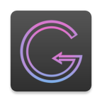

# Goal-Getter-Android-App

Personal goal scheduler, with sub-goals and task - valuable aid to make sure you stick to your goals. Create goals, associate them with sub-goals and tasks with specific repeatability /repetition count.

Once created, tasks can be scheduled in the weekly scheduler section. This allows my Goal Getter app to send notifications and reminders to keep you on track with following up on the scheduled tasks.

<h2>Functionaly & Features</h2>
<h3>Data Encryption, Storage & Context</h3>

Android app homescreen background. Warm, welcoming, promising - relevant to the pursuit of a highly-valued goal. This app allows you to create goals, to associate them with tasks, and to schedule the tasks in the following days & weeks.

Application allows you to work offline, or to sign in via Facebook. Working offline allows you to skip sign-in, to use the app. Completely free to use, no paywall, no need to pay for extra functionality. 

<table cellspacing="20" border="0" width=30%>
      <tr>
        <td width="270" height="135">
          

            
          

        </td>
        <td width="270" height="135">
          

            
          

        </td>
        <td width="500" height="250">
          
                
            <ul>
                  <li>This application stores your goal-related data into an application context object in the JSON format.</li>
                  <li>Signing in via Facebook saves and stores your application context object (goal-related information) in the Google Firebase database servers.</li>
                  <li>Using Facebook allows storing goal-data in the Google Firebase and it associates this data with your Facebook account.</li>
                  <li>This means you can sign in to the Goal Getter app from another device, and goal-data will be automatically downloaded to the new device.</li>
                  <li>Sign-in and password encryption at the server side.</li>
                  <li>On first Facebook sign-in, an empty Goal Datalist object is created in a flat JSON format, in the Firebase database.</li>
                  <li>On consecutive sign-ins, there is a preliminary check to see wheter your local data object is up-to-date, or wheter the latest version should be downloaded from the database.</li>
            </ul>  
          

        </td>
      </tr>
</table>

<h3>Goals Setting</h3>

Create, add, modify goals. The list of goals is saved as an application context object which lives inside the app sandbox. It is there when you open, run and exit the application. This means your goal-related data is automatically saved and retrieved when you close / re-open your app. 

Goals have a multitude of attributes to distinguish them:

<ul>
      <li>Goal title or name.</li>
      <li>Start date and end date. You can only schedule tasks for an associated goal during this time-window, but not outside of it. If the calendaristic date is outside start-end dates, then you cannot schedule your goal's tasks, unless you changes those dates.</li>
      <li>Color - this is important for visual scheduling, because all tasks for this goal will appear in its associated color, to ease organisation & visualization in the scheduling graph. </li>
      <li>Area or domain of interest. This isn't important, but it does randomly select your goal's background image, as it appears in the goal list.</li>
</ul> 
<table cellspacing="10" border="0">
      <tr>
        <td width="300" height="150">
          

            
          

        </td>
        <td width="300" height="150">
          

            
          

        </td>
        <td width="300" height="150">
          

            
          

        </td>
        <td width="300" height="150">
          

            
          

        </td>
      </tr>
</table>

<h3>Sub-goals Partitioning</h3>

Goals can be highly complicated, multi-step adventures! It can be useful to have the posibility to divide a complex goal structure into multiple sub-goals, each with a starting and finishing date. My Goal Getter app allows you to do exactly that!

Divide your goal into multiple sub-goals, based on commonality of tasks. Then, you can add tasks to your sub-goals. For simple & straightforward goals you can associate tasks directly to the goal. Let's have a deeper look into my app functionality: 

<ul>
      <li>Edit your goal title, start & end dates, associated color, and even category.</li>
      <li>Add a new sub-goal to your goal. Give it a title and put in some start/end dates.</li>
      <li>Add new tasks to your sub-goal, or directly to your goal. </li>
      <li>Tasks are simple endeavors, characterized by name descriptor and repetition count.</li>
      <li>Task repetition count gives you the number of times you can schedule your task in the weekly/daily scheduler. Ex: A task like "Strength Training / 100" assumes that you commit yourself to training your strength & muscles for 100 hours, which means you can schedule this task 100 times in your scheduler, with a granularity of 1 hour. Or 50 times, which a granularity of 2 hours.</li>
</ul> 
<table cellspacing="10" border="0">
      <tr>
        <td width="300" height="150">
          

            
          

        </td>
        <td width="300" height="150">
          

            
          

        </td>
        <td width="300" height="150">
          

            
          

        </td>
        <td width="300" height="150">
          

            
          

        </td>
        <td width="300" height="150">
          

            
          

        </td>
      </tr>
</table>
<table cellspacing="10" border="0">
      <tr>
        <td width="300" height="150">
          

            
          

        </td>
        <td width="300" height="150">
          

            
          

        </td>
        <td width="300" height="150">
          

            
          

        </td>
        <td width="300" height="150">
          

            
          

        </td>
      </tr>
</table>

<h3>Weekly Task Scheduler</h3>

The scheduler is a blank-slate fragment navigation pane, which easily allows you to set and organize tasks for every day of the week. The navigation page adapter has 7 slides, which you can swipe left and right to switch between days, Monday to Sunday.

The navigation adapter refreshes date settings every Monday morning, according to current calendaristic week.

<ul>
      <li>Swipe your scheduler left-right to navigate through your weekdays, from Monday to Sunday.</li>
      <li>Click on any valid line representing work-hours or freetime, to schedule a task. Note that you cannot click on past working-hour, because they are invalidated for scheduling.</li>
      <li>Clicking on a valid timeframe will pop up a dialog box which lists all the possible tasks gathered from all the goals in your goal list, which are active.</li>
      <li>Active goals have the current calendaristic date set between the start and end date.</li>
      <li>Select a task from the new dialog box to set it in the weekly schedule. This automaticaly reduces task repetition count.</li>
      <li>If repetition count reached 0, then the task is completed and will no longer be associated to the goal or sub-goal. It will no longer appear in the dialog box and list.</li>
</ul> 
<table cellspacing="10" border="0">
      <tr>
        <td width="300" height="150">
          

            
          

        </td>
        <td width="300" height="150">
          

            
          

        </td>
        <td width="300" height="150">
          

            
          

        </td>
        <td width="300" height="150">
          

            
          

        </td>
      </tr>
</table>

  

    show / hide
  

  <ul class="contains-task-list">
    <li class="task-list-item"><input type="checkbox" id="" disabled="" class="task-list-item-checkbox" checked="" wtx-context="F568DCF6-B057-4A3D-8D28-CC5FA26020AA"> Alert</li>
    <li class="task-list-item"><input type="checkbox" id="" disabled="" class="task-list-item-checkbox" checked="" wtx-context="F0112F11-8E81-4005-8028-C413CB19C2C2"> Artboard</li>
    <li class="task-list-item"><input type="checkbox" id="" disabled="" class="task-list-item-checkbox" wtx-context="70E7E1DA-0B89-4FFC-A343-198EEDC998DE"> App bar</li>
    <li class="task-list-item"><input type="checkbox" id="" disabled="" class="task-list-item-checkbox" checked="" wtx-context="6EAC17E6-7977-4FCF-8202-0902756640B6"> Avatar
  </ul>

  
The title of the image group

  
  
  

